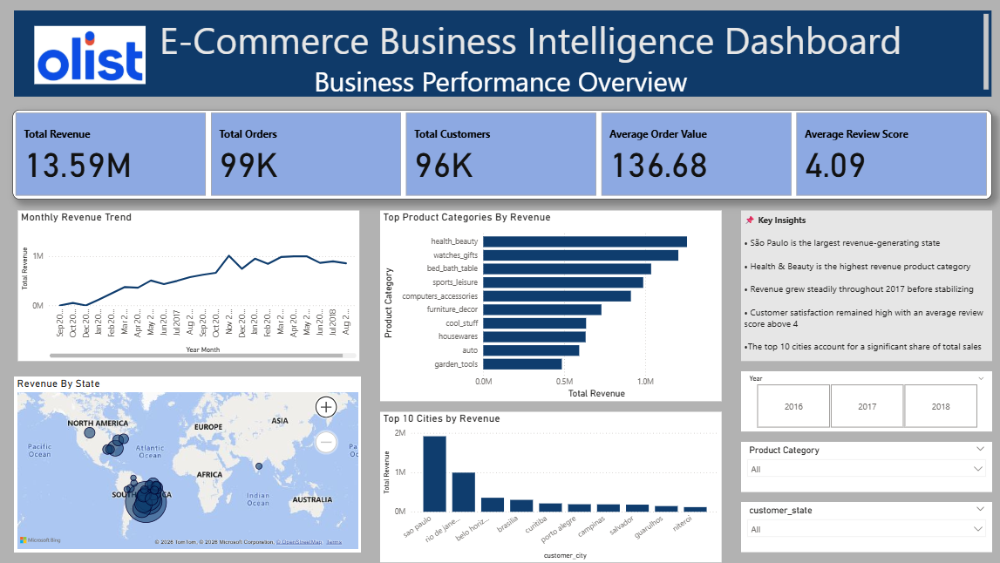
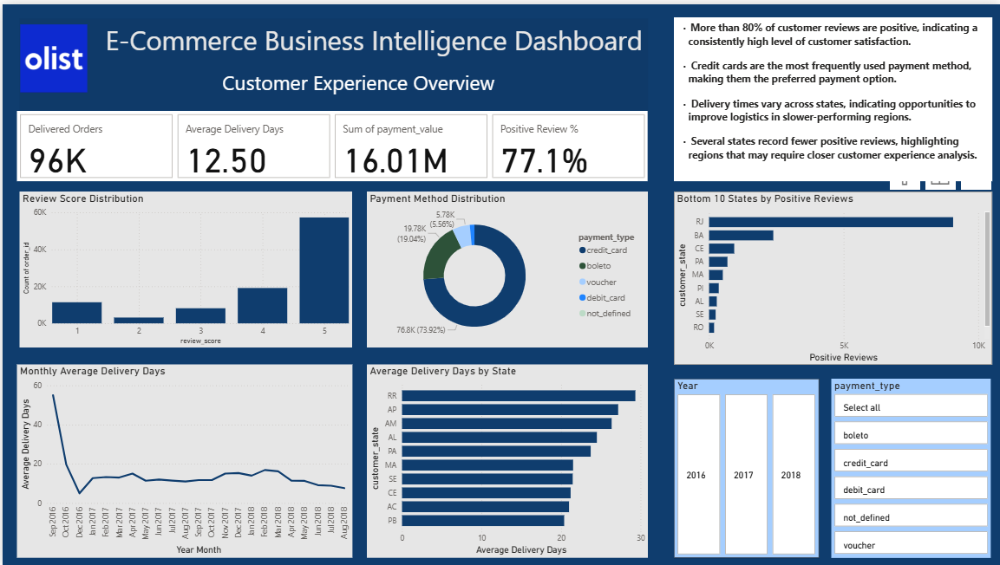
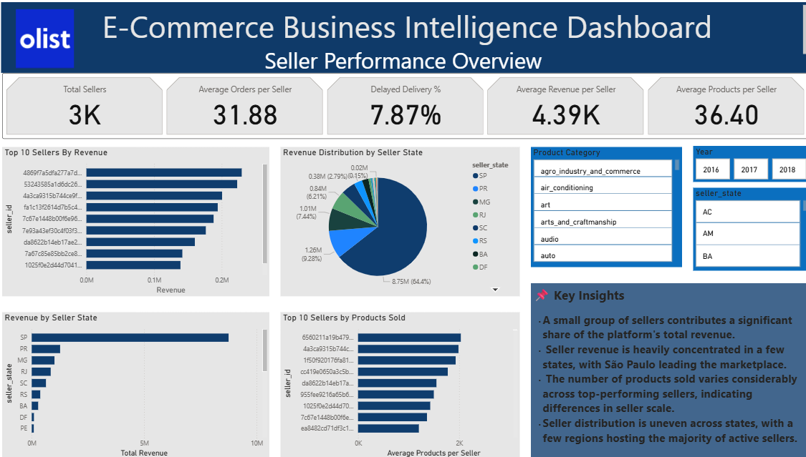

# 📊 Olist E-Commerce Sales Analysis using SQL & Power BI

## 📖 Project Overview

This project presents an end-to-end analysis of the Olist Brazilian E-Commerce dataset using MySQL and Power BI.

The analysis focuses on:

- Sales & Revenue Analysis
- Customer Analysis
- Order & Delivery Performance
- Customer Satisfaction
- Seller Performance

SQL was used to answer business questions and extract insights, while Power BI was used to build interactive dashboards for executive reporting.

---

## 💼 Business Problem

The objective of this project is to analyze sales, customer behavior, delivery performance, and seller performance using the Olist e-commerce dataset. The insights generated help identify revenue trends, customer satisfaction patterns, operational bottlenecks, and top-performing sellers to support data-driven business decisions.

## ❓ Business Questions Answered

- How has revenue changed over time?
- Which product categories generate the highest revenue?
- Which states and cities contribute the most sales?
- How satisfied are customers with their purchases?
- Which payment methods are most frequently used?
- Which sellers contribute the most revenue?
- How efficient is the order delivery process?


## 🛠️ Tech Stack

- MySQL
- Power BI
- Power Query
- DAX
- Data Modeling
- Data Visualization

---

## 📂 SQL Analysis

The SQL analysis is organized into the following modules:

- Basic Joins
- Sales & Revenue Analysis
- Customer Analysis
- Order & Delivery Performance Analysis
- Customer Satisfaction Analysis
- Seller Performance Analysis
- Common Table Expressions (CTEs)
- Window Functions
- Advanced Business Analysis

---

## 📈 Power BI Dashboard

The Power BI dashboard is organized into three analytical pages:

### 📊 Business Performance Overview

- Revenue KPIs
- Revenue Trends
- Product Category Analysis
- Geographic Sales Analysis

### 😊 Customer Experience Overview

- Delivery Performance
- Payment Method Analysis
- Review Analysis
- Customer Insights

### 🏪 Seller Performance Overview

- Seller KPIs
- Seller Revenue Analysis
- Product Performance
- Geographic Seller Distribution

## 📸 Dashboard Preview

### 📊 Business Performance Overview



---

### 😊 Customer Experience Overview



---

### 🏪 Seller Performance Overview



---

## 💡 Key Insights from SQL Analysis

- Identified monthly sales and revenue trends to understand business growth over time.
- Determined the highest revenue-generating product categories, states, and cities.
- Analyzed customer distribution across regions to identify key markets.
- Evaluated order and delivery performance, including average delivery time and delayed orders.
- Assessed customer satisfaction through review score distribution and positive review analysis.
- Identified top-performing sellers based on revenue and order volume.
- Advanced SQL techniques such as CTEs and Window Functions were used to support ranking, trend, and comparative business analysis.

---

## 📈 Key Insights from Power BI Dashboard

- Revenue exceeded **13.5M**, with consistent growth throughout the analysis period.
- Health & Beauty and Watches & Gifts emerged as the highest revenue-generating product categories.
- São Paulo contributed the largest share of both sales revenue and seller activity.
- More than **77% of customer reviews were positive**, indicating strong customer satisfaction.
- Credit Card was the most preferred payment method among customers.
- Seller revenue was concentrated among a relatively small group of high-performing sellers.
- Delivery performance varied across states, highlighting opportunities for logistics optimization.


## 🚀 Skills Demonstrated
- SQL
- MySQL
- Power BI
- Power Query
- DAX
- Data Modeling
- Data Cleaning
- Business Analysis
- Interactive Dashboard Design
- Data Visualization
- Business Intelligence Reporting
  
---

## 📂 Repository Structure

```
olist-ecommerce-sales-analysis/
│
├── sql/
│   ├── basic joins and analysis.sql
│   ├── sales and revenue analysis.sql
│   ├── customer analysis.sql
│   ├── order and delivery performance analysis.sql
│   ├── customer satisfaction analysis.sql
│   ├── seller performance analysis.sql
│   ├── CTE.sql
│   ├── Window functions.sql
│   ├── Advanced Queries.sql
│   └── Olist Ecommerce MySQL Analysis.sql
│
├── screenshots/
│   ├── Business-Performance-Overview.png
│   ├── Customer-Experience-Overview.png
│   └── Seller-Performance-Overview.png
│
├── Olist_E-commerce Analysis Dashboard.pbix
└── README.md
```

## 📌 Dataset

This project uses the **Olist Brazilian E-Commerce Public Dataset**, which contains information on customers, orders, payments, products, sellers, reviews, and geolocation data.

Source:
https://www.kaggle.com/datasets/olistbr/brazilian-ecommerce

---

## 📌 Project Outcomes

This project demonstrates the complete data analytics workflow—from writing SQL queries for business analysis to building an interactive Power BI dashboard for decision-making. It showcases practical skills in SQL, data modeling, DAX, Power Query, and business intelligence reporting.
